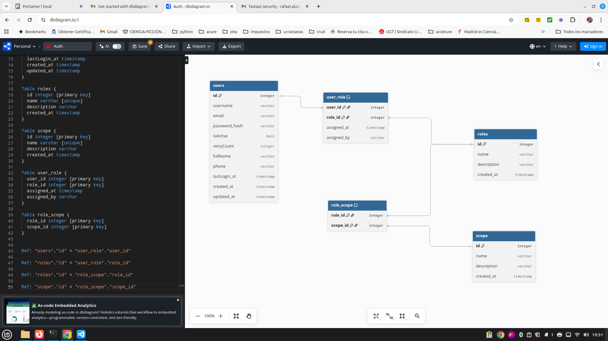

# Diseño funcional del sistema de autenticación centralizado

## Conceptos Básicos

- **Role**: perfil que agrupa un conjunto de permisos. Ej. admin, editor, viewer.  
Es lo que se asigna al usuario. Role es como la tarjeta de acceso a varias salas (Permiso).

- **Scope**: Ambito/permiso granular, es un permiso específico muy concreto. Describe una acción que se puede realizar sobre un recurso.
Ej. users:read, users:write, editor:read

    * Un rol contiene scopes.
    * Un usuario tiene roles.
    * Un usuario hereda los scopes de sus roles
    * Opcionalmente pueden existir scopes directos al usuario o revocarlos individualmente.

- **OAuth 2.0**: es un marco (framework) de autorización que permite que una aplicación obtenga acceso limitado a recursos protegidos en nombre de un usuario, sin necesidad de compartir la contraseña del usuario con la aplicación que solicita acceso.
En otras palabras: es un sistema seguro de “delegación de permisos”.  

- **Multi-Tenant**: Sistema que sirve a multiples clientes (empresas, organizaciones o entornos) manteniendo sus datos.

- **MFA (Multi-Factor Authentication)**: Usar más de un factor para iniciar sessión.

- **OAuth social/enterprise**: Permite iniciar sesión con proveedores externos 
    * Sociales (google, github, etc).
    * Enterprise (azure ad/microsoft entreprise, OKTA, etc).
    * Auth interna: Si requiere que terceros la usen

- **OIDC (Openid Connect)**: es un suplemento de OAUT2 (keycloak) 

## Estructura de datos

El siguiente diagrama muestra las entidades necesarias, sus atributos y como se relacionan

### User

La tabla user contendra la información necesaria para cada usuario del sistema. Su estructura es:

| nombre        | tipo      | PK | Unique | Descripción                       | 
| :------------ | --------- | -- | :----: | --------------------------------  | 
| id            | Integer   | Si | No     | Identificador interno Secuencial  |
| username      | Varchar   | No | Si     | Codigo de usuario                 |
| email         | Varchar   | No | Si     | Email de usuario                  |
| password_hash | Varchar   | No | No     | Password encriptada usuario       |
| password_hash | Varchar   | No | No     | Password encriptada usuario       |
| isActive      | Bool      | No | No     | Si el usuario esta activo         |
| retryCount    | Integer   | No | No     | Número veces login (Default 3)    |
| fullName      | Varchar   | No | No     | Nombre completo usuario           |
| phone         | Varchar   | No | No     | Teléfono usuario                  |
| lastLogin_at  | Timestamp | No | No     | Fecha y hora ultima entrada       |
| created_at    | Timestamp | No | No     | Fecha y hora creación             |
| updated_at    | Timestamp | No | No     | Fecha y hora ultima modificación  |

### Role

La tabla contiene los posibles roles del sistema

| nombre        | tipo      | PK | Unique | Descripción                       | 
| :------------ | --------- | -- | :----: | --------------------------------  | 
| id            | Integer   | Si | No     | Identificador interno Secuencial  |
| name          | Varchar   | No | Si     | Nombre del role                   |
| description   | Varchar   | No | No     | Descripción del role              |
| created_at    | Timestamp | No | No     | Fecha y hora creación             |

### Scope

La tabla contiene los posibles scopes del sistema su nombre sera recurso:accion

| nombre        | tipo      | PK | Unique | Descripción                       | 
| :------------ | --------- | -- | :----: | --------------------------------  | 
| id            | Integer   | Si | No     | Identificador interno Secuencial  |
| name          | Varchar   | No | Si     | Nombre del role                   |
| description   | Varchar   | No | No     | Descripción del role              |
| created_at    | Timestamp | No | No     | Fecha y hora creación             |

### user_role

La tabla contiene los roles que tiene un usuario y los usuarios de un role

| nombre        | tipo      | PK | Unique | Descripción                        | 
| :------------ | --------- | -- | :----: | ---------------------------------- | 
| user_id       | Integer   | Si | No     | Identificador interno user         |
| role_id       | Integer   | Si | No     | Identificador interno role         |
| assigned_at   | Timestamp | No | No     | Fecha y hora creación asignación   |
| assigned_by   | Varchar   | No | No     | Sistema usuario que lo dio de alta |             |

### user_role

La tabla contiene los roles que tiene un usuario y los usuarios de un role

| nombre        | tipo      | PK | Unique | Descripción                        | 
| :------------ | --------- | -- | :----: | ---------------------------------- | 
| user_id       | Integer   | Si | No     | Identificador interno user         |
| role_id       | Integer   | Si | No     | Identificador interno role         |
| assigned_at   | Timestamp | No | No     | Fecha y hora creación asignación   |
| assigned_by   | Varchar   | No | No     | Sistema usuario que lo dio de alta |             |

### role_scope

La tabla contiene los roles que tiene un usuario y los usuarios de un role

| nombre        | tipo      | PK | Unique | Descripción                        | 
| :------------ | --------- | -- | :----: | ---------------------------------- | 
| role_id       | Integer   | Si | No     | Identificador interno role         |
| scope_id      | Integer   | Si | No     | Identificador interno scope        |

