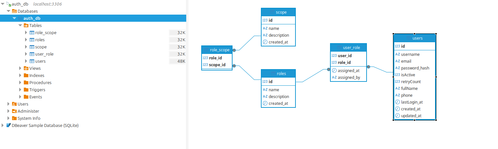

# Diseño Físico del Systema

En resources tienes createTables.sql script SQL para MySQL que crea las tablas, claves primarias/foráneas e índices según tu especificación. He añadido buenas prácticas habituales en MySQL:

ENGINE=InnoDB y utf8mb4 para soporte de transacciones y caracteres.  
id como INT AUTO_INCREMENT donde aplica.  
BOOLEAN como alias de TINYINT(1) (MySQL).  
created_at y updated_at con valores por defecto y ON UPDATE.  
Longitudes razonables para varchar (ajústalas a tus necesidades).  
Claves compuestas en tablas de relación (user_role, role_scope) como pediste.  
Índices en claves foráneas para rendimiento.  

Nota: Usé acentos graves ` ` en nombres de tablas/campos para evitar conflictos; por ejemplo, scope puede superponerse con identificadores en algunos motores.

El siguiente diagrama muestra el modelo fisico

## Comentarios y opciones que puedes ajustar

1. Borrado en cascada:

    * En user_role, al borrar un user se eliminan sus relaciones (ON DELETE CASCADE), y si borras un role se evita por defecto (RESTRICT). Puedes cambiarlo según tu política.
    * En role_scope, he puesto CASCADE al borrar un role para limpiar sus scopes asociados; en scope he dejado RESTRICT para no borrar scopes compartidos accidentalmente.

2. Longitudes:

    * email se ha definido como 320 caracteres (máximo teórico).
    * Ajusta username, fullName, assigned_by, etc., según tu caso.

3. Booleans:

isActive se modela como TINYINT(1) con DEFAULT 1.

4. Timestamps:

* lastLogin_at es nullable y no se actualiza automáticamente.
* updated_at se actualiza solo en users. Si quieres lo mismo en otras tablas, añade ON UPDATE CURRENT_TIMESTAMP.