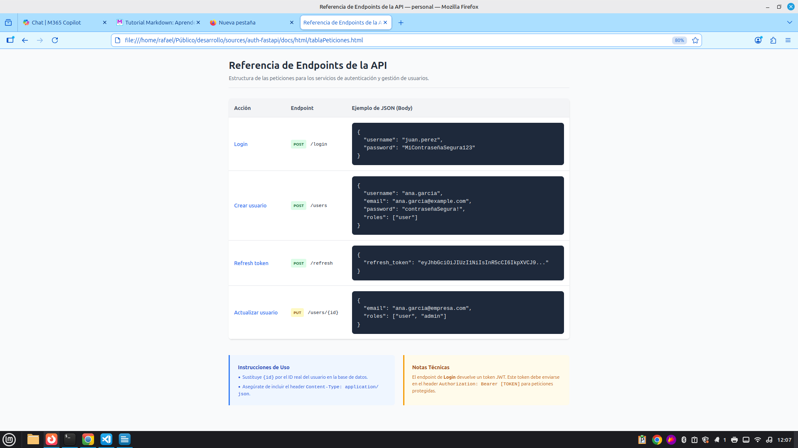
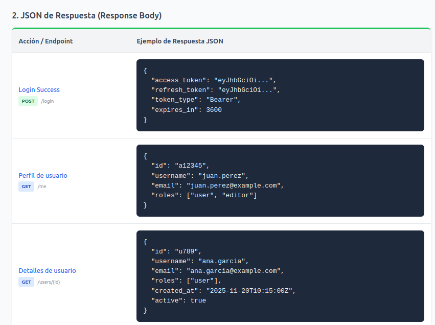
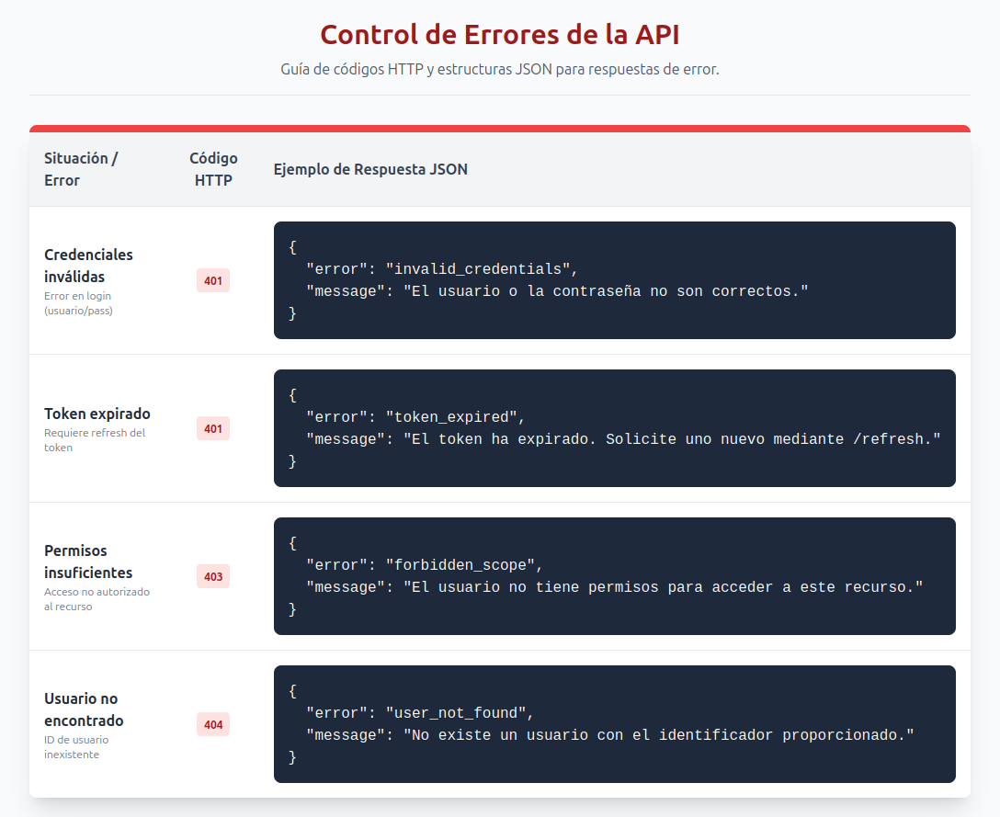

# Especificación de Endpoints del Servicio

## Introducción

El Servicio de Autenticación Centralizada proporciona un mecanismo unificado y seguro para la gestión de identidades dentro de la plataforma. Su objetivo es centralizar todos los procesos relacionados con la autenticación —incluyendo inicio de sesión, validación de credenciales, emisión y renovación de tokens, gestión de sesiones y cierre de sesión— reduciendo la duplicación de lógica entre servicios y garantizando estándares homogéneos de seguridad.  
Este documento describe en detalle los endpoints expuestos por el servicio, sus parámetros, formatos de entrada y salida, códigos de error y flujos principales de uso. Está dirigido a desarrolladores e integradores que necesiten consumir el servicio desde aplicaciones internas, microservicios, frontends u otros componentes externos que dependan de un sistema de identidad confiable.  
El objetivo principal es servir como referencia técnica para facilitar la integración, asegurar un uso correcto de los flujos de autenticación y promover prácticas coherentes dentro del ecosistema de servicios.  

## Conceptos clave

* **Usuario / Identidad**  
Una identidad representa a una persona, aplicación o servicio que necesita autenticarse. Un usuario es una identidad asociada a credenciales y atributos (nombre, correo, roles, permisos…).
En un sistema de autenticación centralizada, las identidades se gestionan en un único punto, lo que garantiza coherencia y control sobre quién accede a qué.  

* **Sesión**  
Una sesión es el estado que se crea cuando un usuario se autentica correctamente.  
Puede representarse mediante:

    - Un token válido
    - Un registro en un servidor de sesiones
    - Un ID de sesión asociado a un dispositivo o navegador

La sesión permite que el usuario no deba autenticarse en cada petición, y define su vigencia y condiciones de expiración.  

* **Token**  
Un token es una credencial emitida por el servicio de autenticación una vez verificada la identidad. Los más comunes son:

    - Access Token

        * Usado para autorizar el acceso a APIs.
        * Tiene una vida corta.
        * Incluye permisos (scopes) e información mínima para validar.

    - ID Token

        * Identifica al usuario autenticado.
        * Contiene información como nombre, email, o el “subject” (sub) que identifica de forma única al usuario.
        * Se usa sobre todo en flujos OIDC.

    - Refresh Token

        * Permite obtener nuevos access tokens sin volver a introducir credenciales.
        * Vida más larga que el access token.
        * Debe protegerse estrictamente ya que otorga acceso prolongado.  

* **Scopes / Claims**

* Scopes
    - Son permisos declarativos que indican qué acciones puede realizar un cliente en nombre del usuario.  
    Ejemplos:

        read:users  
        write:payments  
        admin:all  

    Se solicitan en el proceso de autenticación para limitar el acceso solo a lo necesario.

* Claims

    - Son atributos incluidos dentro de un token (generalmente JWT) que describen detalles del usuario, del cliente o de la sesión.  

        Ejemplos típicos:

        sub – ID único del usuario  
        exp – fecha de expiración  
        roles – roles asociados  
        email – correo verificado  

* **Roles / Permisos (si aplica)**  

Los roles definen agrupaciones de permisos (scopes) asociadas a un tipo de usuario.  
Ejemplos:

    - admin
    - editor
    - viewer

Los permisos, más granulares, determinan acciones específicas.  
En un service mesh complejo, estos pueden integrarse con políticas de autorización externas.  

* **Métodos soportados de autenticación**

El servicio puede ofrecer múltiples métodos para validar la identidad del usuario:

- Password: usuario + contraseña.
- SSO (Single Sign‑On): inicio de sesión único mediante un proveedor externo o corporativo.
- MFA (Multi‑Factor Authentication): combinación de dos o más factores (contraseña + SMS/OTP/app).
- OAuth2: delegación de permisos entre aplicaciones mediante tokens.
- OIDC (OpenID Connect): capa adicional de identidad sobre OAuth2, aporta ID Tokens.
- Certificados / claves públicas: autenticación basada en criptografía asimétrica.
- External providers: Google, Microsoft, GitHub, etc.

Cada método afecta al flujo de autenticación y al tipo de tokens generados.

## Requisitos generales

### URL base del servicio de autenticación

El servicio expone sus endpoints bajo una URL base común, que actúa como punto de entrada para todas las operaciones de autenticación y emisión de tokens.

Ejemplo:  

``` 
https://auth.miempresa.com/api/v1
``` 

La URL base debe ser conocida por todos los servicios que integran autenticación, y su comunicación debe realizarse siempre mediante HTTPS para garantizar la confidencialidad e integridad de los datos.  

### Versionado

El servicio utiliza versionado explícito en su ruta base para permitir la evolución del sistema sin afectar a los clientes existentes.  
Recomendación habitual:

* v1 para la primera versión estable
* Nuevas versiones (v2, v3) cuando se introduzcan cambios incompatibles

El versionado también se puede combinar con encabezados específicos si la organización lo requiere.  

### Formatos soportados

El servicio utiliza JSON como formato estándar tanto para entradas como para salidas.

* Content-Type requerido:
application/json
* Codificación: UTF‑8

Esto asegura la compatibilidad entre servicios internos, frontends y aplicaciones externas.

### Mecanismos de seguridad

El servicio implementa varios métodos para garantizar la autenticación y protección de datos sensibles:  

a) Autenticación básica
Usada en casos concretos como:

- Servicios internos confiables
- Flujos técnicos donde se valida un “client_id + client_secret”  

Debe transmitirse siempre sobre HTTPS.

b) OAuth2 / OIDC (si aplica)
Si el servicio actúa como authorization server:

- Gestiona emisión de access tokens, ID tokens y refresh tokens
- Define flujos como:

    * Resource Owner Password (si se permite)
    * Client Credentials
    * Authorization Code
    * Implicit (no recomendado para nuevas integraciones)
- Permite autenticación federada, perfiles de usuario y claims estándar.

c) Tokens firmados (JWT, JWK…)
El servicio utiliza tokens JWT firmados para garantizar su integridad y verificabilidad.

* Incluyen claims estándar (iss, aud, exp, sub…)
* La firma puede ser:

    - HS256/HS512 (clave simétrica)
    - RS256/ES256 (clave pública/privada)
* Se publica un JWK Set en un endpoint estándar para que los clientes validen la firma:

``` 
https://auth.miempresa.com/.well-known/jwks.json
``` 

### Límites de uso / Rate Limiting

Para proteger el servicio frente a abuso, ataques de fuerza bruta o picos no controlados, se aplican políticas de limitación de peticiones.  
Ejemplos de restricciones:

- Número máximo de intentos de login por minuto
Límite de peticiones por IP o por client_id
- Bloqueo temporal automático tras múltiples fallos de autenticación
- Límite de renovación de tokens en un intervalo dado

Estos límites ayudan a mantener la estabilidad del sistema y reducir riesgos de seguridad.  

## Endpoints por flujo y por recurso

### Endpoints de autenticación

Estos endpoints gestionan exclusivamente la autenticación, emisión/renovación de tokens y control de sesión.  
No gestionan la información del usuario; solo validan credenciales y devuelven tokens.  

* **POST /login**  
Autentica las credenciales del usuario y devuelve uno o más tokens (access, refresh, ID token según el modelo).  

* **POST /refresh**  
Renueva el access token usando un refresh token válido.  

* **POST /logout**  
Revoca tokens y/o sesión activa.

* **GET /me**
Devuelve la información del usuario autenticado en base al token recibido.

No es un CRUD; simplemente refleja la identidad actual.

### Endpoints del recurso users (CRUD)

* **POST /users**  
Crea un usuario nuevo.
➡️ Este sustituye a /register, porque “registrar” un usuario es exactamente crear un recurso user.
Si quieres mantener /register como alias, puedes hacerlo por compatibilidad, pero internamente delegaría en /users.

* **GET /users**  
Listado de usuarios (endpoint normalmente restringido a roles administrativos).

* **GET /users/{id}**
Obtiene la información de un usuario específico.  
* **PUT /users/{id}**
Modifica información del usuario.

* **DELETE /users/{id}**
Elimina o desactiva un usuario.

Resumen

**Endpoints de Autenticación**

| Endpoint | Método | Descripción                                                               | Autenticación Requerida    |
| -------- | :----: | ------------------------------------------------------------------------- | -------------------------- |
| /login   | POST   | Autentica al usuario y genera los tokens correspondientes.                | No (requiere credenciales) |
| /refresh | POST   | Genera un nuevo access token a partir de un refresh token válido.         | Sí (refresh token)         |
| /logout  | POST   | Revoca la sesión y/o tokens activos.                                      | Sí (access token)          |
| /me      | GET    | Devuelve la información del usuario autenticado (claims, perfil básico…). | Sí (access token)          |

**Endpoints del Recurso users (CRUD)**

| Endpoint    | Método | Descripción                                                               | Autenticación Requerida |
| ----------- | :----: | ------------------------------------------------------------------------- | ------------------------|
| /users      | POST   | Crea un nuevo usuario (equivalente a register).                           | Sí (Permisos admin)     |
| /users      | GET    | Lista todos los usuarios.                                                 | Sí (Permisos admin)     |
| /users/{id} | GET    | Obtiene la información de un usuario por ID.                              | Sí                      |
| /users/{id} | PUT    | Actualiza datos del usuario.                                              | Sí                      |
| /users/{id} | DELETE | Elimina o desactiva un usuario.                                           | Sí (admin)              |

## Modelos y ejemplos

### JSON de peticiones

**Tabla: Peticiones**



**Tabla: Respuestas**



## Errores estándar del servicio

Tabla: Errores comunes

| Código              | HTTP | Descripción                            |
| ------------------- | ---- | -------------------------------------- |
| invalid_credentials | 401  | Usuario o contraseña incorrectos       |
| token_expired       | 401  | oken caducado, se debe renovar         |
| forbidden_scope     | 403  | El usuario no tiene el scope necesario |

Ejemplos:




